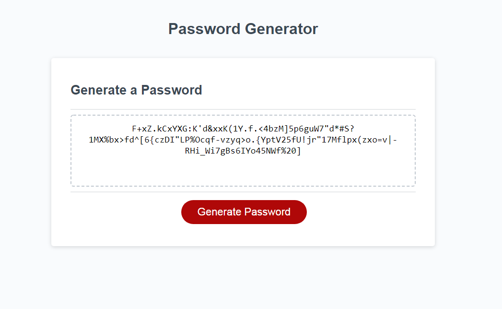

## Password Generator - Challenge 3

The index.html will take you to a password generator. The generator is designed to generate a random password based on selected inputs, including length, and whether or not to include special, numeric, uppercase, and lowercase characters.

The password can be anywhere from 8 to 128 characters in length, and must include at least one selected data type. If no length is selected or if the cancel button is pressed during the length prompt, the function will quit. 

If the provided length is not valid (i.e., outside the range of 8-128), the program will ask the user for an appropriate length and restart.

The program then requests the user confirm to include lower case, upper case, special, and numeric characters.

If no data types are selected, the program will start at the length prompt again.

once at least one valid data type is selected, the program will generate a random password including the selected data types.

Once the password is generated, the code will evaluate the password to verify that it contains the required data types (at least one of each selected type).
If it does not contain at least one of each selected type, the program will generate a new random password.

Github Repository link: https://github.com/nathanh635/Challenge3-PasswordGenerator

Deployed Website: https://nathanh635.github.io/Challenge3-PasswordGenerator/